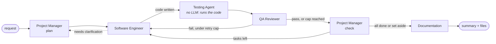

# AI Development Team

[](https://github.com/waleed-w-maqbool-m/ai-dev-team/actions/workflows/tests.yml)

A five-agent software engineering pipeline built on **LangGraph**: a Project
Manager plans, a Software Engineer implements, a Testing Agent *executes* the
code in a sandbox, a QA Reviewer judges it against acceptance criteria with that
evidence in hand, and a Documentation Agent writes it up. It runs on a local
model through **Ollama** (default: Qwen3 8B) or on **Groq**'s hosted API, and
ships with a **benchmark of hidden tests** that measures how often the
generated code actually works.



## Design decisions

- **Routing is code, not conversation.** Every "what happens next" decision is
  plain Python in [`graph/routing.py`](graph/routing.py) reading typed
  Pydantic state. Models fill in structured fields; they never decide control
  flow. Even the PM's choice of next task is only a preference, checked
  against the dependency graph before it's used.
- **Executed evidence, not opinions.** The Testing Agent is the one agent that
  isn't an LLM call: it parses, imports and smoke-runs what the Engineer just
  wrote, and QA reviews with that report in hand. The benchmark has a switch to
  turn it off and measure what it's worth.
- **Generated code runs in a sandbox.** With Docker available, checks run in a
  throwaway container with no network, a read-only filesystem, no
  capabilities, a non-root user and memory/CPU/process limits
  ([`tools/sandbox.py`](tools/sandbox.py)). Without Docker it falls back to a
  host subprocess that at least can't read your API keys or hang on stdin.
- **Every loop is bounded.** QA can send a task back 3 times, clarification
  gets 2 rounds; after that the task is set aside for a human and the run
  moves on. Tasks that can never start (a blocked dependency, a cycle in the
  plan) are set aside too, so a run always finishes.
- **Model output is validated, then trusted.** Each agent's reply must parse
  into its Pydantic schema; on failure the model is re-prompted with the
  validation error (once per provider, in
  [`models/llm_client.py`](models/llm_client.py)). File paths it returns are
  confined to the workspace — `../` and absolute paths are rejected.
- **One model, many roles.** A single client serves every agent; role comes
  from the system prompt ([`prompts/`](prompts/)), the output schema and the
  sampling temperature. Each agent sees only the slice of state it needs
  ([`utils/context.py`](utils/context.py)).

The full design rationale is in
[`ai-dev-team-architecture.md`](ai-dev-team-architecture.md) (written before
the Testing Agent and provider abstraction existed — the code is authoritative
where they differ).

## Benchmark

`bench/` runs the whole pipeline on 12 specified tasks — CLI tools that read
files and stdin, a hand-written expression parser, SemVer precedence rules, a
two-file library plus CLI — and scores the output with **66 hidden test
cases** the agents never see. Every task has a reference solution that CI
checks against its own hidden tests, so the expected outputs are verified too.

Besides "solved", the report tracks **false "done"**: runs where QA approved
every task but the code still fails hidden tests — how often the team's own
review is wrong.

```bash
python -m bench.run --name llama-3.3-70b --provider groq --model llama-3.3-70b-versatile
python -m bench.run --name llama-3.1-8b --provider groq --model llama-3.1-8b-instant
python -m bench.run --name llama-3.1-8b-no-testing --provider groq --model llama-3.1-8b-instant --testing off
python -m bench.report    # writes bench/RESULTS.md
```

Runs resume where they left off, so a run stopped by Groq's free-tier daily
quota can be continued later with the same command. Results are written to
`bench/RESULTS.md`.

## Setup

Requires Python 3.12+.

```bash
pip install -r requirements.txt
```

Then pick a model backend:

**Groq (hosted, free tier).** Get a key at <https://console.groq.com/keys>,
then copy `.env.example` to `.env` and fill it in (or set the same variables
in your shell):

```
LLM_PROVIDER=groq
GROQ_API_KEY=gsk_...
```

The default model is `llama-3.3-70b-versatile`; set `GROQ_MODEL_NAME` to use
another from Groq's catalog. The free tier is rate-limited: short limits are
waited out automatically, and an exhausted daily quota stops the run with a
clear error instead of sleeping for hours.

**Ollama (local, offline).** Needs enough RAM/VRAM for the model.

```bash
ollama pull qwen3:8b
ollama serve
```

`LLM_PROVIDER` defaults to `ollama`, so nothing else is needed.

**Docker (optional, recommended).** If a Docker daemon is running, generated
code is checked inside the sandbox container automatically
(`AI_TEAM_SANDBOX=auto`). Set `AI_TEAM_SANDBOX=docker` to require it.

## Usage

```bash
python main.py "Build a CLI tool that converts CSV files to JSON."
```

Files are written under `workspace/` (override with `AI_TEAM_WORKSPACE`). Run
state is checkpointed to `memory/project_state.db`, so an interrupted run can
be resumed with the same `thread_id`, and every agent message is logged as
JSONL under `memory/logs/`.

### Web console

```bash
cd frontend && npm install && npm run build && cd ..   # once, and after frontend changes
python api.py                                          # then open http://127.0.0.1:8000
```

A React + three.js console (`frontend/`) around one persistent 3D stage:
five sculptural stations, one per agent, joined by light ribbons along the
graph's real edges. Work packets travel between them as agents hand off; a
QA rejection sends one back along the retry arc in red.

- **Story** — a scroll-driven walkthrough: meet each agent (with a real line
  from its prompt), then follow one packet through the graph, rejection
  included, beside the routing code that decides each hop.
- **Theater** — watch a run. *Run live* streams a real pipeline run over
  Server-Sent Events; *Replay* plays back any recorded run through the same
  stage, with each agent's real output (plan, code, test checks, QA findings)
  in the side panel, a seekable timeline, and hold-to-fast-forward.
- **Runs** — every recorded run (web console, `main.py`, benchmark), each
  replayable. Runs are saved automatically as replays.
- **Benchmark** — the real numbers from `bench/results`, or an explicit "not
  measured yet".

It respects `prefers-reduced-motion` (plus an on-page toggle), works by
keyboard, falls back to a static poster without WebGL, and steps quality
down on slow GPUs. `frontend/qa/qa.py` is its Playwright verification loop
(screenshots at three sizes, scroll video, FPS, GPU memory, axe, reduced
motion, no-WebGL). The design brief is in
[`docs/creative-brief.md`](docs/creative-brief.md).

The server binds to `127.0.0.1` only — it executes model-written code, so
never expose it publicly.

### Public deployment (Cloudflare Workers)

The public site is the **replay-only** build: static assets on a Cloudflare
Worker, no backend, no API keys, nothing executed. "Run live" shows as
unavailable there; recorded runs, the Story page and the Benchmark page all
work. `wrangler.jsonc` configures it (SPA routing, `frontend/public/_headers`
for caching and a strict CSP).

Deploy from the Cloudflare dashboard with Git integration:
**Workers & Pages → Create → Import a repository → this repo**, Worker name
`ai-dev-team`, build command `npm run build`, deploy command
`npx wrangler deploy`. Every push to `master` then redeploys. Or from a
machine logged in with `npx wrangler login`: `npm install && npm run deploy`.

Which runs the public site replays is explicit:
`python scripts/export_static_data.py [--publish-bench]` writes
`frontend/public/replays/` and `benchmark.json` — commit them to publish.
(The `pages` workflow builds the same thing for GitHub Pages.)

### Configuration

| Variable | Default | |
|---|---|---|
| `LLM_PROVIDER` | `ollama` | `ollama` or `groq` |
| `GROQ_API_KEY` / `GROQ_MODEL_NAME` | — / `llama-3.3-70b-versatile` | Groq credentials and model |
| `AI_TEAM_MODEL` / `OLLAMA_BASE_URL` | `qwen3:8b` / `http://localhost:11434` | Ollama model and server |
| `AI_TEAM_WORKSPACE` | `./workspace` | where generated files go |
| `AI_TEAM_SANDBOX` | `auto` | `auto`, `docker` or `subprocess` |
| `AI_TEAM_TESTING` | `on` | `off` skips the Testing Agent (for the ablation) |

Retry caps, timeouts and the rest live in
[`config/settings.py`](config/settings.py); per-agent temperatures are on
`RunConfig` in [`schemas/state.py`](schemas/state.py).

## Tests

```bash
pip install -r requirements-dev.txt
pytest
```

The LLM is mocked at its single seam (`BaseAgent.run`), so the suite needs no
model or API key. It covers the full graph (clarification round, QA
fail-then-pass, dependency chains), the retry caps, bad PM answers
(hallucinated or finished task ids, invented statuses, dependency cycles),
workspace path confinement, the Testing Agent's real checks, schema retries
and rate-limit handling, and the benchmark's own reference solutions. CI runs
it on Python 3.12 and 3.13, with the Docker sandbox and with the subprocess
fallback.

## Project structure

| Path | Contains |
|---|---|
| `agents/` | One node function per agent; `testing.py` is the non-LLM one |
| `graph/` | LangGraph wiring (`build_graph.py`) and every routing decision (`routing.py`) |
| `models/` | `LLMClient` interface with schema-validated retries, plus Ollama and Groq backends |
| `schemas/` | Pydantic contracts for every agent's output and the shared `ProjectState` |
| `prompts/` | System prompts as plain Markdown, editable without touching Python |
| `tools/` | Side effects: writing files (`filesystem.py`), running generated code (`sandbox.py`) |
| `utils/` | Per-agent context slicing and the message logger |
| `bench/` | Benchmark tasks, hidden tests, reference solutions, runner and report |
| `frontend/`, `api.py` | Web console (React, three.js, GSAP) and its FastAPI/SSE backend; `frontend/qa/` is its Playwright QA loop |
| `tests/` | pytest suite |

## Known limitations

- Tasks run one at a time; there is no parallel execution.
- A clarification round re-plans the whole task list rather than patching one
  task.
- The Testing Agent proves code parses, imports and starts — it doesn't write
  or run behavioural tests of its own. (The benchmark's hidden tests do, but
  only for scoring.)
- Without Docker, generated code runs on the host with only a scrubbed
  environment and a timeout between it and your files. Use Docker, and don't
  point `AI_TEAM_WORKSPACE` at anything you care about.
- The Docker sandbox image has only the standard library, so generated code
  that needs third-party packages fails its import check there.
