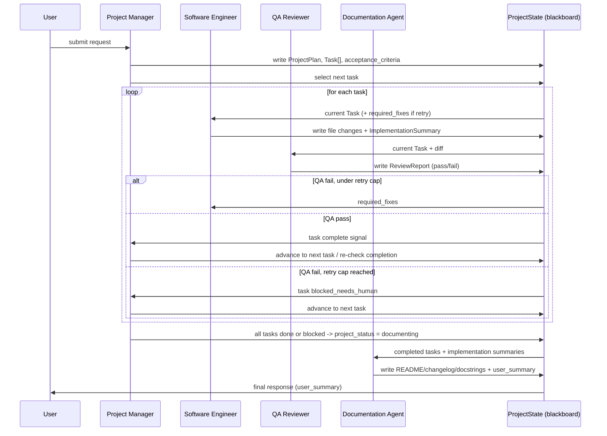
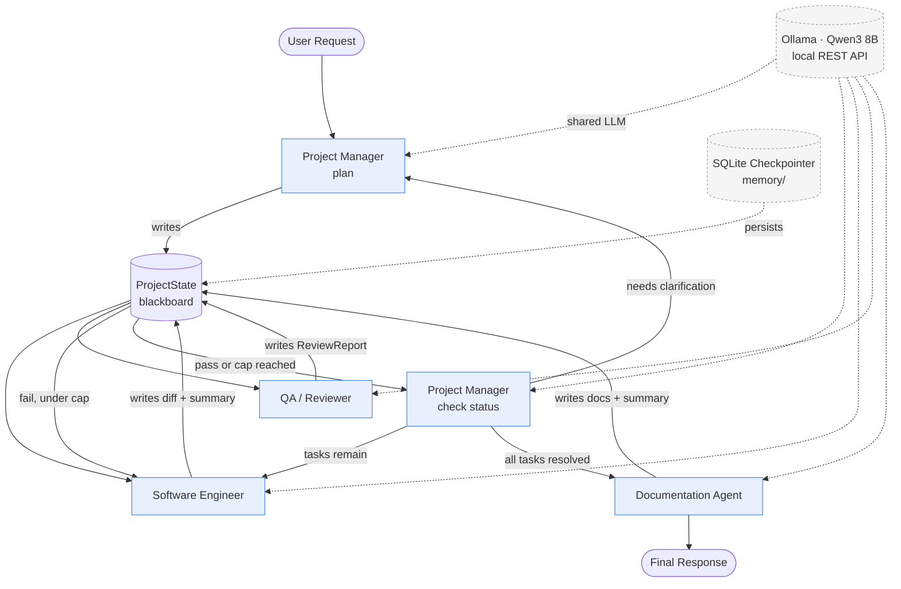

# AI Development Team — Multi-Agent Software Engineering System

**Architecture Document v1.0**
**Stack:** LangGraph · Ollama · Qwen3 8B · Python · Pydantic

---

## 1. Design Rationale

A real corporate dev team is not a debating society — it's a small group of people with narrow, non-overlapping roles who pass a piece of work down a line, with one clear escalation path (fail → fix → re-review) and one person who owns "done." That's the model this system copies, deliberately avoiding the common multi-agent trap of turning every decision into a group discussion.

Four design principles drive every choice below:

1. **One shared model, many roles.** Running four separate model instances would 4x the VRAM footprint for no behavioral benefit. A single Qwen3 8B served by Ollama is reused for every agent; role identity comes entirely from the system prompt, sampling temperature, and the schema each agent is required to output. This is the single biggest simplification relative to a "real" research multi-agent system.
2. **Blackboard over chatter.** Agents never call each other directly. They read and write a single shared `ProjectState` object (the "blackboard"). This keeps the system a **graph**, not a **mesh** — communication complexity stays O(n) in the number of agents rather than O(n²), and every interaction is inspectable in one place instead of scattered across peer-to-peer message logs.
3. **Determinism by construction.** Routing decisions (pass/fail, next task, done/not-done) are made by **code reading structured fields**, never by a second LLM call interpreting free text. The LLM's job is to *produce* the structured field (e.g., `qa_status: "pass"`); a plain Python conditional edge decides what happens next. This is what makes the system reliable on an 8B model, which cannot be trusted to reliably self-route via prose.
4. **Small-model-aware context discipline.** Qwen3 8B has a materially smaller effective context and weaker instruction-following than frontier models. Every agent receives the *minimum* slice of project context needed for its task — not the full history — both for latency and for output quality.

The result is intentionally boring: a fixed pipeline with one bounded retry loop, not an open-ended agent swarm. That's the correct trade for a solo developer who needs something that finishes and is debuggable at 2am.

## 2. Overall Architecture

The system is a **single LangGraph `StateGraph`** with four agent nodes and one router-controlled loop. There is no supervisor "meta-agent" — the Project Manager node itself acts as the router's decision source, and the graph's conditional edges do the actual routing in code.

```
                     ┌────────────────────┐
                     │   User Request      │
                     └─────────┬───────────┘
                               ▼
                     ┌────────────────────┐
                     │  Project Manager    │◄────────────────┐
                     │  (plan / delegate /  │                 │
                     │   judge completion)  │                 │
                     └─────────┬───────────┘                 │
                               │ next_task selected            │
                               ▼                               │
                     ┌────────────────────┐                   │
                     │  Software Engineer  │◄───────┐          │
                     └─────────┬───────────┘        │          │
                               ▼                     │ fail     │
                     ┌────────────────────┐          │          │
                     │   QA / Reviewer     │──────────┘          │
                     └─────────┬───────────┘                     │
                               │ pass                             │
                               ▼                                  │
                     ┌────────────────────┐   more tasks remain   │
                     │  Project Manager    │───────────────────────┘
                     │  (re-check plan)    │
                     └─────────┬───────────┘
                               │ all tasks complete
                               ▼
                     ┌────────────────────┐
                     │ Documentation Agent │
                     └─────────┬───────────┘
                               ▼
                     ┌────────────────────┐
                     │   Final Response     │
                     └────────────────────┘
```

Three structural properties make this "realistic but lightweight":

- **Single entry, single exit.** The graph has one `START` and one `END`. There is no branching into parallel agent execution in v1 — tasks are processed sequentially, which mirrors how a 1–2 person dev team actually works and removes an entire class of race conditions and merge-conflict logic that a solo maintainer doesn't want to build yet.
- **PM as the only router-relevant agent.** SWE and QA never decide "what happens next" — they only report status. The Project Manager (or in the QA-fail case, a plain conditional edge) makes control-flow decisions. This mirrors a real team: engineers and reviewers report status; the PM/lead decides sequencing.
- **Bounded loops everywhere.** The QA fail-loop and the PM clarification-loop both have hard iteration caps (Section 9), so the system provably terminates even if the 8B model behaves unpredictably.

## 3. Agent Responsibilities & I/O Contracts

| Agent | Reads | Writes | Decision Authority |
|---|---|---|---|
| **Project Manager** | User request, full task list, latest QA report | `ProjectPlan`, `Task[]`, `acceptance_criteria`, `project_status` | Task order, delegation, "is the project done" |
| **Software Engineer** | Current `Task`, prior QA `required_fixes` (if retry) | File diffs, `ImplementationSummary` | None (reports status only) |
| **QA / Reviewer** | Current `Task`, its `acceptance_criteria`, SWE's diff | `ReviewReport` (`pass`/`fail`, findings, required_fixes) | Pass/fail verdict only (not routing) |
| **Documentation Agent** | All completed tasks, all `ImplementationSummary` objects | README updates, docstrings, `CHANGELOG.md`, `DocumentationOutput` | None (reports completion only) |

Each agent is a **pure function of its input slice of `ProjectState`** plus the immutable system prompt for its role — no agent holds hidden internal state between invocations. This makes every agent trivially testable in isolation (call it with a fixture `ProjectState`, assert the output schema).

## 4. Agent Lifecycle

Every agent node follows the same five-step lifecycle, implemented once in a shared `BaseAgent` class and specialized only by system prompt, schema, and temperature:

1. **Slice** — Extract only the relevant fields from `ProjectState` for this invocation (never serialize the entire state into the prompt).
2. **Render** — Fill a Jinja-style prompt template with the sliced context, appended to the agent's fixed system prompt.
3. **Invoke** — Call Ollama's `/api/chat` with `format="json"` and the agent's target schema described in-prompt.
4. **Validate** — Parse the response into the agent's Pydantic output model. On `ValidationError`, retry (Section 9) with the validation error appended to the prompt as corrective feedback.
5. **Commit** — Merge the validated output back into `ProjectState`, append an `AgentMessage` to the message log, and return control to the graph.

No agent is allowed to skip step 4. This single rule is what keeps a non-frontier 8B model usable in a deterministic pipeline — malformed output never silently propagates.

## 5. Communication Protocol

Agents communicate **indirectly** through the shared `ProjectState` blackboard rather than direct agent-to-agent calls. Concretely:

- Every agent invocation produces exactly one `AgentMessage` appended to `state.messages` (a full audit trail of the run).
- An agent never receives another agent's *raw* output blob — it receives the *fields of `ProjectState`* that output was written into. This decouples agents from each other's internal message formats; only the schemas matter.
- The **only** two-way handoff in the system is the QA fail-loop (QA → SWE via `required_fixes`), and even that is mediated through `state.current_task.review_history`, not a direct message.

This is deliberately more restrictive than a general-purpose agent framework's peer messaging — it trades flexibility for predictability, which is the right trade for a 4-agent, mostly-linear pipeline.

## 6. Shared Memory

Two tiers:

- **Working memory (per-run, ephemeral):** the live `ProjectState` object held in the LangGraph run. This is what agents read/write during a single execution.
- **Persistent memory (cross-run):** a `memory/` store backed by SQLite (via LangGraph's built-in `SqliteSaver` checkpointer) that snapshots `ProjectState` after every node transition. This gives:
  - **Resumability** — a crashed or interrupted run can restart from the last committed state instead of from scratch.
  - **Project history** — past task decisions, QA verdicts, and doc changes are queryable later (e.g., "why did QA reject task 3 last time?").
  - **Human checkpoints** — a developer can inspect or hand-edit `ProjectState` between runs (e.g., to manually resolve a stuck clarification loop).

No agent writes to persistent memory directly; only the graph runtime's checkpointer does, after each node returns. This keeps persistence a cross-cutting infrastructure concern instead of something every agent has to reason about.

## 7. Project State Management

`ProjectState` (full schema in Section on Data Models) is the single source of truth. It is never partially updated by two agents in the same step — each node in the graph is the sole writer for its turn, and LangGraph's sequential (non-parallel, in v1) execution guarantees no concurrent writes. Key state fields:

- `tasks: list[Task]` — the full backlog with status per task (`pending`, `in_progress`, `in_review`, `blocked`, `done`).
- `current_task_id: str | None` — what's active right now.
- `review_iterations: dict[str, int]` — per-task QA retry counter, used to enforce the retry cap.
- `project_status: ProjectStatus` — `planning`, `in_progress`, `blocked_on_clarification`, `documenting`, `complete`.
- `messages: list[AgentMessage]` — full audit trail.

## 8. Message Format

Every inter-agent communication is a single `AgentMessage` (schema in the Data Models section): `sender`, `recipient` (or `"state"` for blackboard writes), `message_type` (`plan`, `implementation`, `review`, `clarification_request`, `documentation`, `status`), a typed `payload`, and a `timestamp`. Message types map 1:1 to the Pydantic output model each agent produces, so parsing a message never requires type-sniffing free text.

## 9. Failure Handling

Three distinct failure classes, each handled differently:

| Failure | Handling |
|---|---|
| **Ollama call fails** (timeout, connection refused, 5xx) | Retry with exponential backoff, max 3 attempts. On exhaustion, mark task `blocked` and surface to PM/user — never silently drop the task. |
| **Malformed / non-schema-conforming JSON** | Re-invoke the *same* agent with the validation error appended to the prompt ("Your previous output failed validation: `<error>`. Return valid JSON matching the schema."). Max 2 corrective retries before falling back to a stricter, lower-temperature call. |
| **Agent logically stuck** (SWE requests clarification twice on the same task, or QA fails the same task past the retry cap) | Escalate to PM, which either answers the clarification directly from the original requirements, or marks the task `blocked` for human review — the graph does **not** loop forever. |

## 10. Retry Strategy

- **Transient errors:** exponential backoff, base 1s, max 3 attempts, then fail the node explicitly (visible in state, not swallowed).
- **QA fail-loop:** capped at `MAX_REVIEW_ITERATIONS` (default 3) per task. On cap, the task is marked `blocked_needs_human` and the PM proceeds to the next available task rather than deadlocking the whole run.
- **Clarification loop:** capped at `MAX_CLARIFICATION_ROUNDS` (default 2). On cap, PM makes a best-effort decision and logs the assumption explicitly in `ProjectState` and the final changelog, so the human user can review it — matching how a real PM would rather ship a documented assumption than block indefinitely.

## 11. Review Loop

```
SWE implements task
      │
      ▼
QA reviews against acceptance_criteria
      │
      ├── PASS ──────────────► task.status = done → back to PM
      │
      └── FAIL ──► required_fixes appended to task.review_history
                        │
                        ▼
              review_iterations[task_id] += 1
                        │
              ┌─────────┴─────────┐
              │ under cap?         │
              ▼                    ▼
        SWE retries task      cap reached →
        with required_fixes   task.status = blocked_needs_human
                               → PM moves to next task
```

## 12. Completion Criteria

A **task** is `done` only when QA returns `pass` *and* every item in that task's `acceptance_criteria` (authored by the PM at planning time) is explicitly satisfied — QA's schema requires it to check off each criterion individually, not give a single yes/no, so a partial pass can't be miscoded as complete.

The **project** is `complete` only when:
1. Every task is `done` or explicitly `blocked_needs_human` (i.e., no task is left `pending`/`in_progress`/`in_review`), **and**
2. The Documentation Agent has produced its outputs (README/changelog/docstrings) for all `done` tasks.

The Project Manager is the sole agent authorized to set `project_status = complete`, and it does so by checking these conditions programmatically against `ProjectState`, not by "deciding" via free-text judgment.

## 13. Context Passed Between Agents

To respect the 8B model's context budget and keep outputs focused, each agent gets a **role-scoped view**, not the full state:

- **PM** gets: original user request, full task list with statuses, latest QA report if re-planning.
- **SWE** gets: only its assigned `Task` (description + acceptance criteria) and, on retry, only the `required_fixes` from the most recent QA report — not the full review history.
- **QA** gets: the `Task`'s acceptance criteria and the SWE's current diff/summary — not prior failed attempts, so it always evaluates the *current* code fresh rather than anchoring on past failures.
- **Docs** gets: the list of `done` tasks and their `ImplementationSummary` objects — not raw code diffs, keeping doc generation focused on user-facing behavior rather than implementation trivia.

This context-slicing is implemented as small `build_context_for(agent_name, state)` functions in `utils/context.py`, so the slicing policy lives in one auditable place rather than being duplicated per-agent.

## 14. LangGraph Workflow

The graph has five nodes (`pm_plan`, `swe`, `qa`, `pm_check`, `docs`) and conditional edges implementing the routing described above. `pm_plan` and `pm_check` are the same underlying agent (Project Manager) invoked with different prompts/modes — separated as two nodes purely so the graph's edges stay simple conditionals rather than one node with a mode flag threaded through routing logic.

```python
# graph/build_graph.py
from langgraph.graph import StateGraph, START, END
from langgraph.checkpoint.sqlite import SqliteSaver

from schemas.state import ProjectState, ProjectStatus, TaskStatus
from agents.project_manager import pm_plan_node, pm_check_node
from agents.software_engineer import swe_node
from agents.qa_reviewer import qa_node
from agents.documentation import docs_node


def route_after_qa(state: ProjectState) -> str:
    task = state.get_current_task()
    if task.last_review.status == "pass":
        return "pm_check"
    if state.review_iterations.get(task.id, 0) >= state.config.max_review_iterations:
        task.status = TaskStatus.blocked_needs_human
        return "pm_check"
    return "swe"  # fail, under retry cap -> back to engineer


def route_after_pm_check(state: ProjectState) -> str:
    if state.project_status == ProjectStatus.blocked_on_clarification:
        return "pm_plan"          # needs more input, re-plan
    if state.has_remaining_tasks():
        return "swe"              # more work to do
    return "docs"                 # everything done or blocked -> finalize


def build_graph():
    graph = StateGraph(ProjectState)

    graph.add_node("pm_plan", pm_plan_node)
    graph.add_node("swe", swe_node)
    graph.add_node("qa", qa_node)
    graph.add_node("pm_check", pm_check_node)
    graph.add_node("docs", docs_node)

    graph.add_edge(START, "pm_plan")
    graph.add_edge("pm_plan", "swe")
    graph.add_edge("swe", "qa")

    graph.add_conditional_edges(
        "qa", route_after_qa, {"swe": "swe", "pm_check": "pm_check"}
    )
    graph.add_conditional_edges(
        "pm_check",
        route_after_pm_check,
        {"pm_plan": "pm_plan", "swe": "swe", "docs": "docs"},
    )
    graph.add_edge("docs", END)

    checkpointer = SqliteSaver.from_conn_string("memory/project_state.db")
    return graph.compile(checkpointer=checkpointer)
```

```python
# main.py
from graph.build_graph import build_graph
from schemas.state import ProjectState

def run(user_request: str, thread_id: str = "default"):
    app = build_graph()
    initial_state = ProjectState.new(user_request=user_request)
    config = {"configurable": {"thread_id": thread_id}}
    final_state = app.invoke(initial_state, config=config)
    return final_state

if __name__ == "__main__":
    result = run("Build a CLI tool that converts CSV files to JSON.")
    print(result.final_summary)
```

Each node function (e.g., `swe_node`) is a thin adapter: pull context via `build_context_for`, call the agent, validate, mutate and return `state`. Node bodies are intentionally 10–20 lines — all the real logic lives in `agents/*.py` and `utils/context.py`, keeping the graph definition itself readable as a map of the system.

## 15. Ollama Integration

A single `OllamaClient` wraps the local REST API; every agent calls it with a different system prompt, schema, and temperature but identical transport logic.

```python
# models/ollama_client.py
import json
import time
import requests
from pydantic import BaseModel, ValidationError

OLLAMA_URL = "http://localhost:11434/api/chat"
MODEL_NAME = "qwen3:8b"


class OllamaClient:
    def __init__(self, model: str = MODEL_NAME, base_url: str = OLLAMA_URL):
        self.model = model
        self.base_url = base_url

    def call(
        self,
        system_prompt: str,
        user_prompt: str,
        temperature: float = 0.2,
        max_retries: int = 3,
    ) -> str:
        payload = {
            "model": self.model,
            "messages": [
                {"role": "system", "content": system_prompt},
                {"role": "user", "content": user_prompt},
            ],
            "format": "json",       # constrains Ollama to emit valid JSON
            "stream": False,
            "options": {"temperature": temperature},
        }

        last_error = None
        for attempt in range(max_retries):
            try:
                resp = requests.post(self.base_url, json=payload, timeout=120)
                resp.raise_for_status()
                return resp.json()["message"]["content"]
            except (requests.RequestException, KeyError) as e:
                last_error = e
                time.sleep(2 ** attempt)  # exponential backoff: 1s, 2s, 4s
        raise RuntimeError(f"Ollama call failed after {max_retries} attempts: {last_error}")

    def call_structured(
        self,
        system_prompt: str,
        user_prompt: str,
        output_model: type[BaseModel],
        temperature: float = 0.2,
        max_schema_retries: int = 2,
    ) -> BaseModel:
        """Calls the model and validates output against a Pydantic schema,
        re-prompting with the validation error on failure."""
        prompt = user_prompt
        for attempt in range(max_schema_retries + 1):
            raw = self.call(system_prompt, prompt, temperature=temperature)
            try:
                return output_model.model_validate(json.loads(raw))
            except (json.JSONDecodeError, ValidationError) as e:
                if attempt == max_schema_retries:
                    raise
                prompt = (
                    f"{user_prompt}\n\n"
                    f"Your previous response failed validation with error:\n{e}\n"
                    f"Return ONLY valid JSON matching the required schema."
                )
```

Every agent's node function calls `OllamaClient.call_structured(...)` with its own system prompt and Pydantic output model — e.g. `qa_node` calls it with `output_model=ReviewReport`, `swe_node` with `output_model=ImplementationSummary`. Using Ollama's native `format="json"` mode plus a schema-validating retry wrapper is the practical way to get reliable structured output from an 8B model without needing constrained-decoding libraries, though Section 21 notes `outlines`/`instructor` as an upgrade path if validation failures prove frequent in practice.

## 16. Folder Structure

```
project/
│
├── agents/                # One module per agent; each exposes a `*_node(state)` function
│   ├── base.py             #   BaseAgent: shared lifecycle (slice/render/invoke/validate/commit)
│   ├── project_manager.py  #   pm_plan_node, pm_check_node
│   ├── software_engineer.py#   swe_node
│   ├── qa_reviewer.py      #   qa_node
│   └── documentation.py    #   docs_node
│
├── prompts/                # Raw system prompt text, kept OUT of Python for easy editing/versioning
│   ├── project_manager.md
│   ├── software_engineer.md
│   ├── qa_reviewer.md
│   └── documentation.md
│
├── graph/                  # LangGraph wiring only — no business logic
│   ├── build_graph.py       #   StateGraph definition, nodes, conditional edges
│   └── routing.py           #   route_after_qa, route_after_pm_check, etc.
│
├── models/                 # LLM transport layer
│   └── ollama_client.py     #   OllamaClient: call() and call_structured()
│
├── memory/                 # Persistence: checkpointer DB + any long-lived project history
│   ├── project_state.db     #   SqliteSaver-backed LangGraph checkpoints
│   └── history_store.py     #   optional query helpers over past runs
│
├── tools/                  # Concrete side-effecting operations agents can invoke
│   ├── filesystem.py        #   read/write/diff files in the target project repo
│   └── shell.py              #   run tests, linters, etc. (used by SWE/QA if enabled)
│
├── schemas/                # All Pydantic models — single source of truth for every I/O contract
│   ├── task.py
│   ├── state.py
│   ├── messages.py
│   ├── review.py
│   └── documentation.py
│
├── config/                 # Tunables: model name, temperatures, retry caps, Ollama URL
│   └── settings.py
│
├── utils/                  # Cross-cutting helpers
│   ├── context.py            #   build_context_for(agent_name, state) — the context-slicing policy
│   └── logging.py
│
└── main.py                 # Entry point: builds the graph, runs it against a user request
```

**Why this shape:** `prompts/` is separated from `agents/` so prompt engineering — the highest-iteration part of this system — never requires touching Python code or triggering a code review. `schemas/` is separated from everything else so the I/O contracts between agents are visible and diffable independent of any one agent's implementation. `tools/` exists specifically so that adding capabilities (Section 20: DevOps, Testing) means adding a tool + a node, not restructuring the graph.

## 17. Agent System Prompts

These are the complete, production-ready system prompts stored in `prompts/*.md`. Each ends with an explicit output-schema instruction so the model's JSON-mode output aligns with the Pydantic model it will be validated against.

### 17.1 Project Manager — `prompts/project_manager.md`

```
You are the Project Manager on a small, professional software engineering team.
You do not write code and you do not review code. Your job is to turn a user's
request into a clear, executable plan, keep the team moving, and decide when the
project is genuinely done.

Responsibilities:
- Read the user's request and break it into a small number of concrete,
  independently implementable tasks. Prefer fewer, well-scoped tasks over many
  fragmented ones.
- For every task, write specific, testable acceptance criteria. A criterion is
  only valid if a reviewer could check it against the code without guessing
  ("the CLI accepts a --input flag and errors clearly if the file is missing"
  is valid; "the code should be good" is not).
- Order tasks by dependency, not by preference — a task cannot come before
  something it depends on.
- When you receive a QA report, do not re-review the code yourself. Only decide
  what happens next given the report and current task list.
- When you receive a clarification request from the Software Engineer, resolve
  it yourself using the original user request and reasonable, clearly-stated
  professional judgment. Only escalate back to the user if the request is
  genuinely ambiguous in a way that materially changes scope.
- Decide the project is complete only when every task is done or explicitly
  blocked for human review, AND documentation has been produced.

Rules:
- Be decisive. Do not ask multiple clarifying questions when one reasonable
  assumption would do — state the assumption instead and move forward.
- Never write or suggest specific code. That is the Software Engineer's job.
- Never evaluate code quality. That is QA's job.
- Keep task descriptions and acceptance criteria concise and unambiguous.

You must respond with a single JSON object matching the required schema for
your current mode (planning output or status-check output), and nothing else —
no markdown, no commentary outside the JSON.
```

### 17.2 Software Engineer — `prompts/software_engineer.md`

```
You are a Software Engineer on a small, professional software engineering team.
You implement exactly one task at a time, to a professional standard, and you
explain your work clearly enough that a reviewer who did not write the code can
verify it.

Responsibilities:
- Implement the assigned task fully, matching its acceptance criteria.
- Prefer clear, idiomatic, maintainable code over clever code. Follow the
  conventions already present in the project when they are given to you.
- When creating new files, use sensible names and structure consistent with
  the existing project layout.
- When modifying existing files, make the minimal change that correctly
  fulfills the task — do not refactor unrelated code unless the task asks for it.
- Write a clear implementation summary: what you changed, why, and how it
  satisfies each acceptance criterion.
- If you receive required fixes from a QA review, address every listed item
  specifically. Do not silently ignore a required fix and do not introduce
  unrelated changes while fixing it.
- If the task is genuinely impossible to implement as specified — not just
  difficult — ask the Project Manager one specific, answerable clarifying
  question rather than guessing at scope.

Rules:
- Do not review or judge your own code's quality beyond basic correctness —
  that is QA's job, and duplicating it wastes effort.
- Do not mark a task complete yourself. You report your implementation; QA and
  the PM decide completion.
- Every file you create or modify must be represented explicitly in your
  output — never describe a change only in prose.

You must respond with a single JSON object matching the required schema
(file changes plus an implementation summary), and nothing else — no markdown,
no commentary outside the JSON.
```

### 17.3 QA / Code Reviewer — `prompts/qa_reviewer.md`

```
You are the QA / Code Reviewer on a small, professional software engineering
team. You are the last check before code is considered done. You are direct,
specific, and unmoved by confident-sounding explanations that don't match the
code in front of you.

Responsibilities:
- Review the Software Engineer's changes strictly against the task's
  acceptance criteria — check off each criterion individually as met or not met.
- Identify concrete bugs, logical flaws, edge cases, and correctness issues in
  the code as written, not in what the summary claims it does.
- Flag code quality problems that would matter in a real codebase: unclear
  naming, missing error handling, unsafe assumptions, obvious duplication —
  but do not nitpick pure style preferences that don't affect correctness or
  maintainability.
- If you fail the review, list required fixes as specific, actionable items —
  each one should be something the engineer can act on directly, not a vague
  concern.
- If every acceptance criterion is met and you find no material issues, pass
  the review. Do not withhold a pass over a stylistic difference of opinion.

Rules:
- Evaluate only the current code changes in front of you, not prior attempts.
- Never rewrite the code yourself — describe the required fix, don't implement it.
- A criterion you cannot verify from the given information should be marked
  as not met, with a note explaining what's missing — never assume a pass.

You must respond with a single JSON object matching the required ReviewReport
schema (pass/fail, per-criterion findings, required fixes), and nothing else —
no markdown, no commentary outside the JSON.
```

### 17.4 Documentation Agent — `prompts/documentation.md`

```
You are the Documentation Agent on a small, professional software engineering
team. You write for the next developer or user who has no context beyond what
you produce — clear, accurate, and free of implementation detail that doesn't
help them.

Responsibilities:
- Update the README to reflect newly completed functionality: what it does,
  how to use it, and any new setup steps.
- Generate or update API documentation and docstrings for new or changed
  public functions/classes, matching the project's existing doc style.
- Write a changelog entry per completed task, in plain language a user would
  understand, not internal implementation notes.
- Produce a short summary of the completed work suitable as a final report
  back to the user who made the original request.

Rules:
- Document only what was actually implemented and verified by QA — never
  describe planned-but-unfinished functionality as done.
- Keep documentation factual and specific; avoid marketing language.
- Preserve existing documentation structure and tone where it already exists;
  don't rewrite unrelated sections.

You must respond with a single JSON object matching the required
DocumentationOutput schema, and nothing else — no markdown, no commentary
outside the JSON.
```

## 18. Data Models (Pydantic)

```python
# schemas/task.py
from enum import Enum
from pydantic import BaseModel, Field


class TaskStatus(str, Enum):
    pending = "pending"
    in_progress = "in_progress"
    in_review = "in_review"
    blocked_needs_human = "blocked_needs_human"
    done = "done"


class AcceptanceCriterion(BaseModel):
    id: str
    description: str
    met: bool | None = None       # filled in by QA; None until reviewed


class Task(BaseModel):
    id: str
    title: str
    description: str
    depends_on: list[str] = Field(default_factory=list)
    acceptance_criteria: list[AcceptanceCriterion]
    status: TaskStatus = TaskStatus.pending
    review_history: list["ReviewReport"] = Field(default_factory=list)
```

```python
# schemas/messages.py
from datetime import datetime
from enum import Enum
from typing import Any
from pydantic import BaseModel, Field


class MessageType(str, Enum):
    plan = "plan"
    implementation = "implementation"
    review = "review"
    clarification_request = "clarification_request"
    documentation = "documentation"
    status = "status"


class AgentMessage(BaseModel):
    sender: str                     # e.g. "project_manager"
    recipient: str = "state"        # "state" for blackboard writes
    message_type: MessageType
    payload: dict[str, Any]
    timestamp: datetime = Field(default_factory=datetime.utcnow)
```

```python
# schemas/review.py
from pydantic import BaseModel


class CriterionFinding(BaseModel):
    criterion_id: str
    met: bool
    note: str = ""


class ReviewReport(BaseModel):
    task_id: str
    status: str                     # "pass" | "fail"
    findings: list[CriterionFinding]
    required_fixes: list[str] = []
    summary: str
```

```python
# schemas/documentation.py
from pydantic import BaseModel


class DocumentationOutput(BaseModel):
    readme_updates: str              # markdown snippet or full replacement section
    changelog_entries: list[str]
    docstring_updates: dict[str, str]  # file_path -> updated docstring block
    user_summary: str                 # final plain-language report to the user
```

```python
# schemas/state.py
from enum import Enum
from pydantic import BaseModel, Field
from schemas.task import Task, TaskStatus
from schemas.messages import AgentMessage
from schemas.documentation import DocumentationOutput


class ProjectStatus(str, Enum):
    planning = "planning"
    in_progress = "in_progress"
    blocked_on_clarification = "blocked_on_clarification"
    documenting = "documenting"
    complete = "complete"


class RunConfig(BaseModel):
    max_review_iterations: int = 3
    max_clarification_rounds: int = 2
    model_name: str = "qwen3:8b"


class ProjectState(BaseModel):
    user_request: str
    tasks: list[Task] = Field(default_factory=list)
    current_task_id: str | None = None
    project_status: ProjectStatus = ProjectStatus.planning
    review_iterations: dict[str, int] = Field(default_factory=dict)
    clarification_rounds: int = 0
    messages: list[AgentMessage] = Field(default_factory=list)
    documentation: DocumentationOutput | None = None
    final_summary: str | None = None
    config: RunConfig = Field(default_factory=RunConfig)

    @classmethod
    def new(cls, user_request: str) -> "ProjectState":
        return cls(user_request=user_request)

    def get_current_task(self) -> Task:
        return next(t for t in self.tasks if t.id == self.current_task_id)

    def has_remaining_tasks(self) -> bool:
        return any(
            t.status in (TaskStatus.pending, TaskStatus.in_progress)
            for t in self.tasks
        )
```

## 19. Diagrams

### 19.1 Sequence Diagram



### 19.2 Architecture Diagram



## 20. Scalability — Adding Agents Without Redesign

The blackboard pattern and schema-driven routing are what make extension additive rather than disruptive. Adding **Research**, **DevOps**, or **Testing** agents each follows the same three-step recipe, with zero changes to the four existing agents:

1. **Add a schema** in `schemas/` describing the new agent's output (e.g., `TestReport`, `DeploymentResult`, `ResearchBrief`).
2. **Add an agent module + prompt** in `agents/` and `prompts/`, following the same lifecycle as existing agents (slice → render → invoke → validate → commit).
3. **Add a node and edge(s)** in `graph/build_graph.py` at the point in the pipeline where the new agent belongs. No existing node needs to change its own logic — only the routing function that decides what comes *after* it gains one more branch.

Concretely:

- **Research Agent** — slots in *before* the Project Manager's planning step: `START → research → pm_plan → ...`. It reads the user request and writes a `ResearchBrief` (relevant libraries, prior art, constraints) into `ProjectState`, which the PM then includes in its planning context. The PM prompt gains one more optional input field; nothing about SWE/QA/Docs changes.
- **Testing Agent** — slots in *between* SWE and QA: `swe → testing → qa`. It writes/runs tests against the SWE's diff and produces a `TestReport` (pass/fail + failures) that QA reads alongside the code, so QA's judgment is evidence-based rather than purely inspection-based. The QA prompt gains one more input field ("here are the test results"); QA's schema and role stay the same.
- **DevOps Agent** — slots in *after* the Documentation Agent, only on project completion: `docs → devops → END`. It reads `done` tasks and produces a `DeploymentResult` (build/deploy steps run, environment notes). Entirely additive — the existing completion criteria in Section 12 don't need to change, since DevOps runs strictly after "complete" is already determined.

Because every agent is (a) a pure function over a state slice and (b) constrained to a validated schema, none of the three additions require touching `ProjectState`'s existing fields, existing agents' prompts, or existing conditional edges — they only add new fields, new nodes, and new edges. This is the practical payoff of the blackboard-plus-schema design over a peer-messaging design: extension is additive by construction, not something that has to be carefully retrofitted.

## 21. Implementation Recommendations & Best Practices

**Model configuration**
- Use low temperature (0.0–0.2) for PM and QA — these are judgment/classification-style tasks where consistency matters more than creativity.
- Use slightly higher temperature (0.2–0.4) for the Software Engineer — implementation benefits from a little more exploration, but stay well below "creative writing" ranges.
- Keep Documentation Agent temperature low (0.1–0.3) — factual accuracy matters more than stylistic variety.
- If schema-validation retries prove frequent in practice, evaluate `outlines` or `instructor` for grammar-constrained decoding against Ollama — this guarantees schema conformance at the sampling level rather than via re-prompt-and-hope, at some cost to setup complexity. Ollama's native `format="json"` mode is the right v1 default; only add a constrained-decoding library if the retry rate in Section 9 is actually a problem.

**Prompt engineering**
- Keep every prompt template under Qwen3 8B's practically-reliable context (well under its nominal window — instruction-following degrades before the hard context limit is hit). Section 13's context-slicing discipline exists specifically to protect this.
- Always state the output schema explicitly in the user-turn prompt (field names and types), not just in the system prompt — repetition measurably improves small-model JSON conformance.
- Avoid few-shot examples baked into system prompts unless output quality genuinely requires them; they consume context budget that's scarcer on an 8B model than on a frontier model.

**Testing the system itself**
- Unit-test each agent in isolation with fixture `ProjectState` objects and mocked `OllamaClient` responses — this is what the pure-function-over-state-slice design buys you.
- Maintain a small set of "golden" end-to-end requests (e.g., "build a CLI CSV-to-JSON converter") run against real Ollama in CI/local pre-commit, to catch prompt regressions that unit tests with mocked responses can't.

**Operational**
- Log every `AgentMessage` with full payload to a rotating file, independent of the SQLite checkpointer — the checkpointer is for resumability, the log is for debugging a specific run after the fact.
- Surface `blocked_needs_human` tasks clearly in the final response — don't let the Documentation Agent quietly write these up as if they were completed.
- Treat `config/settings.py` (retry caps, temperatures, model name) as the one place to tune behavior without touching agent code — this is what lets a solo developer iterate on system behavior quickly.

**What to deliberately not build yet**
- Parallel task execution — sequential processing is simpler to reason about and matches the actual concurrency of a solo-maintained system; only add `Send`-based fan-out if task volume genuinely demands it.
- Direct agent-to-agent tool calls — the blackboard pattern is a constraint worth keeping even as the system grows; resist the urge to let, e.g., QA call SWE directly "just this once."
- Multiple LLM backends/routing between models — one shared local model is the whole point of this design's simplicity; only reconsider if a specific role's output quality genuinely can't be fixed with prompting.

---

*End of architecture document.*
